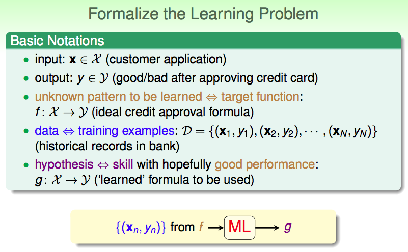
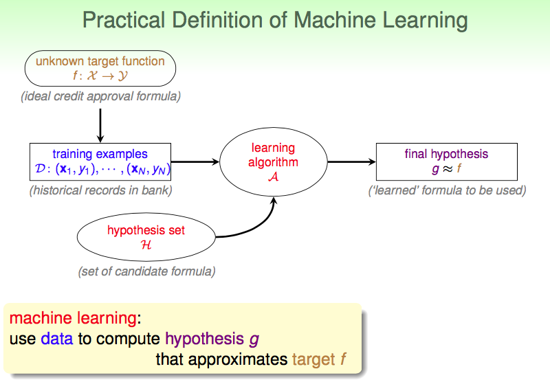

# 1. The Learning Problem

## 课程介绍

> 课程 is not theory oriented nor techniques oriented, but **foundation oriented**. 即讲述 philosophical illustrations, key theory, core techniques, usage in practice, and hopefully jokes, 认为这些是机器学习从事者（初学者）要作为领域基石的内容.

## 学习、机器学习，及使用场景

### learning and ML

什么是学习（learning）？反思人类学习过程，并不是思维中做出一些rules的规定，而是通过大量观察（observations）学得了某个技巧（skill），可以分析数据（data）的某些特征、共性（patterns）【以树木识别类比】.即 observations -> learning -> skill. 我们希望模拟人类learning的方式，让机器也学得skill.这种learning方式我们称为machine learning.

skill是什么？skill我以为对于及其就是一个模型（函数映射）；对于一个问题，我们要找到，某些可以被量化的能力指标，这种指标可以在某个程度上反映学习的效果（学到了多少知识？）。我们希望我们的模型（函数映射）可以在获得更高的评分。

> 与ML相对应的就是，规则性的编程，比如一些传统算法。机器学习是让机器用某种方式自己去学。

### scenarios

* 人没有办法去编程的环境（火星）

* 没有好的对于答案的定义（speech/visual recognition）【一些有准确解的算法问题x】

* 需要快速的决定（rapid decisions, like high-frequency trading）

* 用户导向性的大数据问题（consumer-targeted marketing）

> > 认为意思是诸如推荐系统的问题，很难以用普通的方式建立适用于所有用户的规则，因而让机器自己学习，人不去辅助。

## 机器学习的关键要素（是否要用机器学习？）

1. 认为**问题**有潜在的模式（patterns）可被学习

2. 没有 programmable definitions

3. data about the patterns

## 一些经典问题

> 回归问题、推荐（系统）、（预测）、图像识别、二分类...

## 符号标记（Notations）与符号化流程

一个未知的目标函数`f`产出了一堆有标签的data，我们希望从`f`可能的存在的函数集合`H`中，得到一个`f`的估计函数`g`，`g`可以在较高的程度上表现`f`.而学习的方式就是learning algothrim（`A`）.

即我们的学习模型就是（`A`&`H`）.

## 相似领域分析

### 数据挖掘（`data mining`）

data mining: use (huge) data to **find property** that is interesting.

当数据挖掘中 `find property` 与 机器学习中 `hypothesis that approximate target` 一致时，ML = DM. 如果两者是相关联的，则可以彼此help. 此外，传统的DM常关注在大数据集上的高效计算.

> 数据挖掘要求专业领域的知识要高些=。=

### 人工智能（`AI`）

Artificial Intelligence: compute something that shows intelligent behavior.

机器学习是AI的一个实现途径，即让机器拥有某些智能的决策、计算等能力。

### 统计学（`statistics`）

statistics: use data to make inference about an unknown process.

机器学习可利用统计学，实现对f的预测. (useful tool)

***

> 提及的比赛: KDDCup

