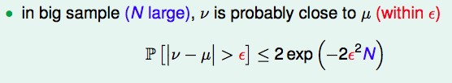
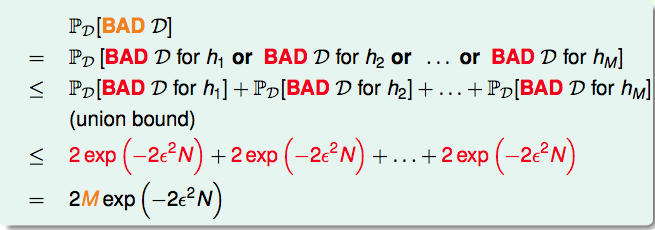

# 4. Feasibility of learning

> 本节课讨论的机器学习在数学上的可行性，主要是从概率的角度。将机器学习的过程与取样过程进行对比。

## 预测的结果真的可以吗？

林老师在开始举了几个范例，想说明用已知完全准确的推出未知是不可能的，对已知可能有很多很多种解释，“**No free lunch**”。其实就是样本数不够。

## Hoeffding’s Inequality（霍夫丁不等式）

the statement ‘⌫ = μ’ is probably approximately correct (PAC)

> 给出了随机变量的经验期望与其实际期望偏差的概率上限

> > TODO：不是很清楚切比雪夫不等式和霍夫丁不等式的主要差别，存疑。

## 对一个hypothesis的好坏的验证

`h`与`f`的相似性，我们真的可以判断出来吗？即我们验证了h在输入数据`D`上的准确率，这个准确率真的可以等价/近似于`h`与`f`的相似性吗？

诶，可以的，在数据量N足够大的情况下。

$E_{in}(X) \approx E_{out}(X)$

## 信任的从一堆hypothesis中选择一个g

可以验证一个hypothesis了，验证一个基本不会出错。但是如果可能的集合足够大呢？甚至无穷呢？很可能产生某个h，使得输入数据D在其上进行的验证是不好的，即$E_{in}(X) !\approx E_{out}(X)$. 这样子的D，我们成为**BAD D**；我们希望可以证明，在数据集足够大的情况下，可以证明对于所有的hypothesis，出现一个BAD D出现的概率有上界，且趋近于0。

其实就是在霍夫丁不等式上乘了个常数。不过只是对于有限个hypothesis的证明。

***

由以上，我们可以知道，在数据量够大的情况下，有限的hypothesis中，learning的可行性是可以被保证的。

> 主要需要这个新的视角，BAD DATA的定义这些，有感性的认识。

