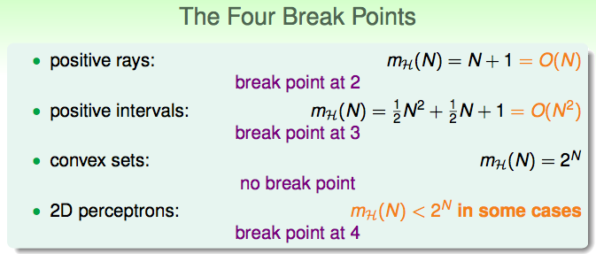

# 5. training and testing

开始解决预测空间无限大的情况。

* 待解决的两个问题：

1. Ein与Eout是否可以做到足够close?

2. 我们可以做到让Ein(g)足够小吗？

* 对于M【预测空间大小】的权衡：

1. 更小的M，Ein与Eout可以做到越近。即产生Bad D的概率更小

2. 但更小的M，g的可能选择就变少，不一定能找到足够好的g

***

开始考虑通过一些方式将M转为有限量。M的来源是因为概率的放缩，使用了所有hypothesis产生bad data的可能的独立假设。【注意，bad data 要尤其关注不在输入测试集中的数据】。对于感知机，可以想象，在一个间隙中，存在很多条等价的直线将元素分为两类。【此处，问题被转换为一个二分类问题，即直线将点集分为两类，并以此作为直线的区分】

> 不过此时，这个调整只是对训练集上的分类，直线的微调对于未知的点还是有影响的，这一点会在下一课阐明。

***

如果按二分（dichotomy）对直线分类，我们可以发现直线的类别由无限种变为了2^n. 但一个指数样子的东西虽然是有限界，但还是很难受，我们希望可以找到多项式阶的界。

下面考察了对于三种问题的二分可能随N（D训练集大小）增大的变化【被称为了growth function】。（即，上界是指数的，但真的是指数的嘛？我们要细节研究下。）

* growth function for positive rays

* growth function for positive intervals

* growth function for convex sets

* growth function for 2D perceptrons

> 在考察break point的时候，要注意，它代言着一个紧的上界，即在N=k时，对于每一种D（数据），H都无法产生2^k种分类预测。

引出了break point的概念！就是它的出现很好的限制了上界的扩张，降至多项式阶。它出现的实际也非常重要，引出了DV dimension的概念，作为一种H（预测空间）的一个特征。

到了这里，我们开始猜想，对于不存在break point的H，它的growth function是指数阶的，对于存在break point k的，它的growth function是不超过 {k-1}阶的。下回分解啦。

