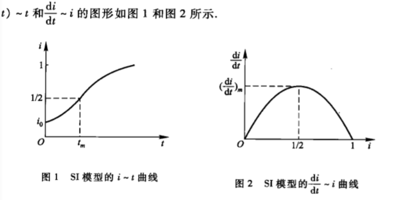

## 微分方程模型（非物理领域的实际问题）

### 1.传染病模型
   ### 模型一 ：最简单的模型 
   平均每天每个病人感染的人数为常数a,在t到t+Δt的时间内有      

​                                                           y(t+Δt)-y(t)=ay(t)Δt
​                                                             $\frac{dy}{dt}$=a*y(t)     y(0)=y~0~

​                                                               y(t)=y~0~*e^at^

   ### 不足：
   病人接触的人群中只有健康人会被感染。
   ### 模型二（SI模型）：
   假设考察地区内总人数N不变，不考虑生死和迁移。人群分为易感染者（susceptible）和已感染者（infective），这两类在总人群中所占比例为s(t),i(t)。平均每个病人每天接触到的平均人数是a个，其中是s(t)*a个被感染。每天新增的感染人数为
                                               $\frac{di}{dt}$=a*i*(1-i)           i(0)=i~0~
              i(t)=$\frac{1}{1+{1}{i~0~}-1*e^-at^}$
              

   ### 不足：没有考虑到病人被治愈的情况
   ### 模型三（SIS模型）
   得了某些传染病后（伤风，痢疾）免疫力很低，可再次被感染。假设与第二个相同，但增加一个每天治愈人群比例b，则每天新增病人
                                               $\frac{di}{dt}$=a*i*(1-i)-b*i

​                                                    定义 σ=a/b                                       

### 模型四(SIR模型） 
  大多数传染病（天花，流感，水泡）治愈后均有很强抵抗力，治愈人群将被移除。模型假设同模型二，治愈的人所占比例为r(t)。显然有：
                                                                     s(t)+i(t)+r(t)=1
  对于治愈被移除的人r(t)有
                                                                             $\frac{dr}{dt}$=b*i
  SIR模型的方程可设为
                                                                         $\frac{di}{dt}$=a*s*i-b*i
                                                                         $                                                   \frac{ds}{dt}$=-a*s*i

  无法求出是s(t)和i(t)的解析解

用MATLAB分析

### 2.经济增长模型
#### （1）Douglas生产函数
  用Q(t),K(t),L(t)分别表示某一地区在时刻t的产值，资金和劳动力。对于固定的t，他们的关系可简记为
                 Q=F(K,L)
  引入z=Q/L, 代表每个劳动力的产值，y=K/L代表每个劳动力的投资
  假设z=c*y^α^
  上式中F的具体形式为
               Q=c*K^α^*L^1-α^     0<α<1

  而著名的Cobb-Douglas生产函数，更一般的形式是
               Q=c*K^α^L^β^  0<α，β<1
#### (2)劳动力和资金的最佳分配
  这里根据上上式，假定资金来自贷款，利率为r，每个劳动力需付工资w,于是当资金K，劳动力产生产值Q时得到的效益为
             S=Q-rK-wL
  这个用微分法即解得
           Q~K~/Q~L~=r/w    Q~K~，Q~L~是Q分别对K和L的偏导数
  有 
                      $\frac{K}{L}$=$\frac{αw}{(1-α)r}$
  这就是资金与劳动力的最佳分配。由上式可以看出，当α，w变大，r变小时，分配的比例变大
#### （3）劳动生产率增长的条件
对劳动力和资金的增长做出合理化假设
1. 投资增长率与产值成正比，比例系数a>0.
2. 劳动力的相对增长率为常数b,b可以是负数，表示负增长。
                                                         解得L(t)=L~0~*e^at^      
 

